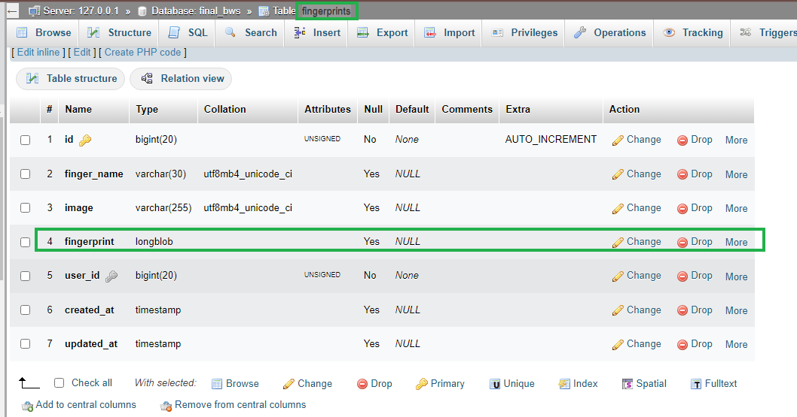
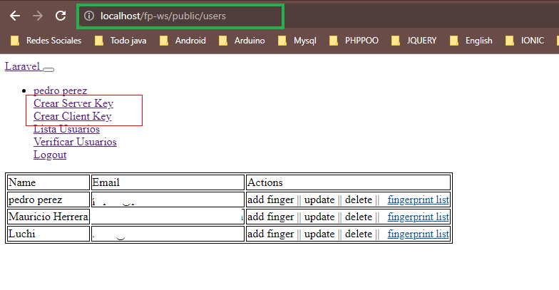
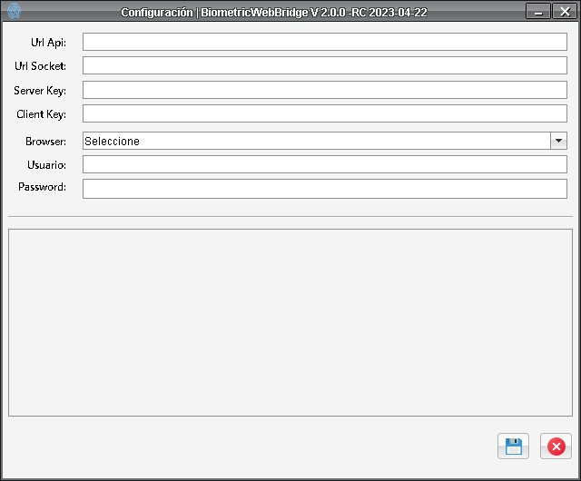

## DPFP 4500 Para Laravel | Comunicación por WebSockets
Lector de huella FP 4500 Digital Persona + WebSockets

[](https://opensource.org/licenses/MIT)
[](https://packagist.org/packages/mhtutorials/dpfp4500ws)
[](https://packagist.org/packages/mhtutorials/dpfp4500ws)
<!-- [](https://packagist.org/packages/mhtutorials/dpfp4500ws)-->


## Video Tutorial
https://youtu.be/Q2OziNSHN2U

## Pre-Requisitos
1. Tener composer instalado
2. Tener NodeJs instalado
3. CRUD de usuarios funcional en tu aplicación laravel.


## Crear proyecto laravel si aún no lo has creado
1.Puedes usar laravel new:
Si tienes el instalador de Laravel (laravel/installer) instalado globalmente, puedes usar el siguiente comando:
```bash  
    laravel new nombre-del-proyecto
```
Reemplaza nombre-del-proyecto con el nombre que deseas para tu nuevo proyecto Laravel.

2.Puedes usar composer create-project:
Si prefieres utilizar Composer directamente, puedes hacerlo de la siguiente manera:
```bash  
    composer create-project --prefer-dist laravel/laravel nombre-del-proyecto
```
Al igual que antes, reemplaza nombre-del-proyecto con el nombre que deseas para tu nuevo proyecto Laravel.

## Crear Dominio Local:
Sigue el paso a paso que nos comparte nuestro amigo de codersfree.com
https://codersfree.com/posts/configurar-virtualhost-xampp-windows-guia-paso-a-paso

## Instalar rutas de api (Laravel 10 o superior)

Ejecuta el comando: 
```php
    php artisan install:api
```

## Regenerar id de proyecto (Laravel 10 o superior)

Ejecuta el comando: 
```php
    php artisan key:generate
```

Con esto se creará el archivo api.php en el directorio routes.

## Crear Login (Opcional)

Ejecuta el siguiente comando para descargar el paquete de login de laravel 
```bash
    composer require laravel/ui    
```

Ejecuta el siguiente comando para publicar las vistas del login
```php
    php artisan ui:auth
```

## Instalación

Para instalar el paquete, ejecuta el siguiente comando en tu terminal:

    composer require mhtutorials/dpfp4500ws

Una vez instalado, publicar los modelos, controladores, vistas, migraciones, etc.
Para ello ejecuta el siguiente comando en tu terminal:
```php
    php artisan vendor:publish --tag=mhtutorials-dpfp4500ws-p
```

## Agregar configuración al archivo config/services.php

Copiar la clave "mhdpfp" en el archivo config/services.php de tu aplicación.
En esta configuración se almacenará la clave de api para que el pluguin pueda
conectarse a los servicios de tu proyecto laravel.

NOTA: si tu archivo ya contiene otras claves puedes agregarla al final como una clave mas del array
```php
return [   
 'mhdpfp' => [
            'key' => env('PLUGIN_BIOMETRIC_KEY'),        
     ],
];
```

## Modificar archivo .env

Crear la clave: PLUGIN_BIOMETRIC_KEY en tu archivo .env de la siguiente manera:

```php
PLUGIN_BIOMETRIC_KEY="tu clave aqui"
```

El valor de la clave se genera codificando en base 64 "usuario:contraseña".

Un ejemplo de tu clave api: codifica "tu_usuario:tupass" -> resultado dHVfdXN1YXJpbzp0dXBhc3M=
esta ultima será la clave que debes configurar.

Puedes ir a la pagina: https://www.base64encode.org/, copia tu_usuario:tupass y da click en el botón
"ENCODE", el resultado seria: dHVfdXN1YXJpbzp0dXBhc3M=

NOTA: Estas credenciales se configurarán posteriormente en el plugin biometrico.


## Agregar Rutas api

1. Copia el import a continuación en tu archivo routes/api.php

    ```php  
    use App\Http\Controllers\DpfpApi\UserRestApiController; 
    ```

2. Copia y pega las rutas a continuación en tu archivo routes/api.php

    ```php  
    //SensorRestApi
    Route::post("list_finger", [UserRestApiController::class, "index"]);
    Route::post("save_finger", [UserRestApiController::class, "store"]);
    Route::post("sincronizar", [UserRestApiController::class, "sincronizar"]);
    ```


## Agregar Rutas web

1. Copia los import a continuación en tu archivo routes/web.php

    ```php  
    use App\Http\Controllers\DpfpApi\UserRestApiController;
    ```

2. Copia y pega las rutas a continuación en tu archivo routes/web.php

    ```php    
    //Rutas para interactuar con el plugin
    Route::get('/users', [UserRestApiController::class, 'users_list'])->name('dpfp.index');
    Route::get('/users/verify_users', [UserRestApiController::class, 'verify_users'])->name('verify_users');
    Route::get('/users/getdata_users/{user_id}/{fingerId}', [UserRestApiController::class, 'getDataUser'])->name('getdata_users');
    Route::get("/users/{user}/finger-list", [UserRestApiController::class, "fingerList"])->name("finger-list");
    ```

## Ejecutar las migraciones:

 1. Ejecuta el comando
    ```php  
       php artisan migrate
    ```
## Actualizar campo tipo BLOB a LONGBLOG:

2. Modifica el campo 'fingerprint' de tipo blob a longblob en la tabla: fingerprints 




## Agrega la relación de huellas al modelo User.php

Copia y pega la relacion a continuación en tu modelo User.php
```php  
//Relacion uno a muchos
public function fingerprints() {
       return $this->hasMany("App\Models\DpfpModels\FingerPrint");
}
```

## Cambia la siguiente linea en el archivo ServerNodeJs/index.js
  
http://pruebafp.test por http://tu-dominio en las lineas 6 y 20
```javascript
    res.setHeader('Access-Control-Allow-Origin', 'http://pruebafp.test');

    origin: "http://pruebafp.test",
```

## Instala Express en el servidor NodeJs: ServerNodeJs
Ingresa a la ruta del servidor NodeJs en tu ptoyecto, ejempo: "Tu_Proyecto_Laravel/ServerNodeJs"  y ejecuta el comando:
```bash  
    npm install express
```


## Instalar PM2 en tu proyecto:

Instalar Node.js si aun no lo has instalado:

PM2 es una herramienta de administración de procesos de Node.js, por lo que necesitas tener Node.js instalado en tu sistema. Puedes descargar la última versión de Node.js 
desde su sitio web oficial https://nodejs.org/en.

1. Instalar PM2:

Abre la línea de comandos (cmd) como administrador.
Ejecuta el siguiente comando para instalar PM2 de forma global:

```bash  
    npm install pm2 -g
```

El flag -g instala PM2 globalmente para que puedas acceder a él desde cualquier lugar en tu sistema.

2. Verificar la instalación:

Después de la instalación, puedes verificar si PM2 se instaló correctamente ejecutando el siguiente comando:
```bash 
    pm2 --version
```
Esto debería mostrar la versión de PM2 que has instalado.

3. Uso básico:

Para ejecutar una aplicación con PM2, navega hasta el directorio de tu aplicación en la línea de comandos y ejecuta el siguiente comando:

```bash 
    pm2 start app.js
```
(Reemplaza "app.js" con el nombre de tu archivo principal de la aplicación).

4. Para ver la lista de procesos gestionados por PM2, utiliza el siguiente comando:

```bash 
    pm2 list
```

5. Puedes detener una aplicación con PM2 usando:

```bash 
    pm2 stop <app_name_or_id>
```
(Reemplaza "<app_name_or_id>" con el nombre o el ID de tu aplicación).

Puedes obtener más información sobre PM2 y sus comandos en la documentación oficial de PM2.


## Información Importante:

Recuerda publicar el acceso directo a "storage" para que se puedan almacenar las huellas de los usuarios,
para ello ejecuta el comando a continuación:
```php  
php artisan storage:link
```


## Descargar y configurar el plugin biometrico solo para windows

Descarga el instalador del plugin biometrico "BiometricWebBridgeSocket-For-Laravel Setup.exe" desde el siguiente enlace:
https://drive.google.com/file/d/1tp2r1HAzlwuOGaIloYNPRsazr08cSXU8/view?usp=sharing

1. Abre el programa plugin biometrico, diligencia los campos en el formulario de configuración

    Url Api: es la url de tu proyecto que apunta hacia las rutas de api, ejemplo:
    http://localhost/tu-projecto/public/api/ o http://tu-dominio.xx/api/

   
    Url Socket: es la url de tu proyecto con el cual configuraste el web socket, por defecto es: ws://localhost:3000
    
    Para obtener las claves ve a la ruta de tu proyecto: /users y da click los links "Crear Server Key" y "Crear Client Key"

   
    

    


    Server Key y Client Key: Son las claves generadas por la aplicacion web

    

    
    Usuario y Password: Son las credenciales que codificaste un paso mas arriba, en el apartado 'Modificar archivo .env',
    para este ejemplo son:

    Usuario: tu_usuario

    Password: tupass

    Ahora presiona el botón con el icono de guardar, el plugin se reiniciara automaticamente y si todo ha quedado 
    bien configurado ya puedes comenzar a enrolar y verificar las huellas de tus usuarios.


    Espero que este paquete te ayude en tus proyectos :)

    


